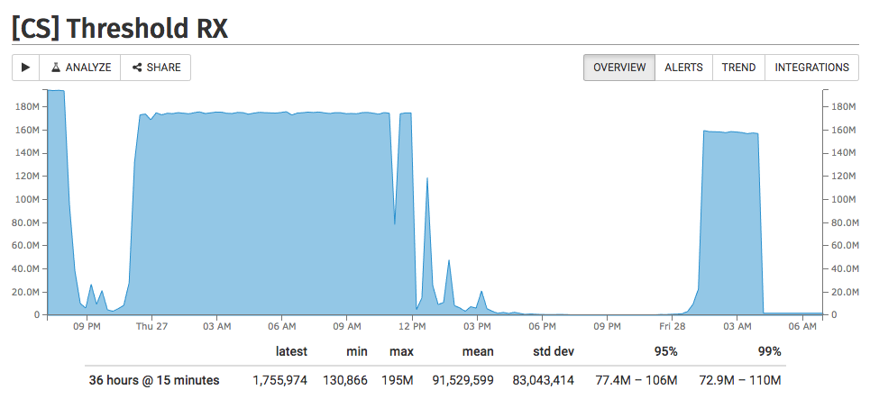

# Luzifer / continuous-spark

This tool is a daemon intended to do continuous tests against a [sparkyfish server](https://github.com/chrissnell/sparkyfish). The measurements are sent to [StatHat](https://www.stathat.com/) for graphing and are stored locally in a TSV file for reference.

_Why?_ Quite easy: My internet connection is quite often way slower (170Kbit vs. 200Mbit) as promised in the contract I'm paying for so I set up this daemon on my NAS connected using 2x1Gbit cable to my providers FritzBox. On the other side an unmodified sparkyfish server is running on a 1Gbit datacenter connection. The test is executed every 15m and looking at the graph causes me to weep...

